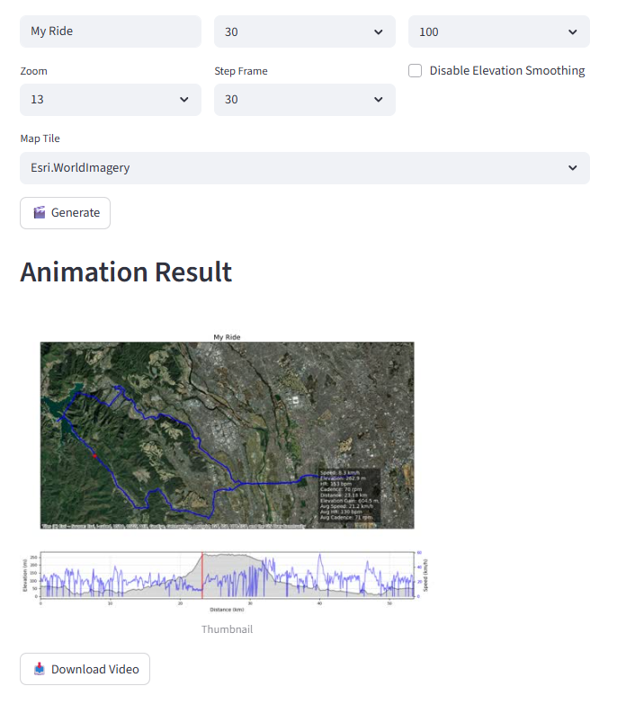

# 🚴 Ride Animator Service

Ride Animator Service is a full-stack application that transforms `.fit` ride files into animated map videos. Built with FastAPI, Streamlit, Redis, and RQ, it provides a user-friendly interface for cyclists, developers, and researchers to visualize ride data beautifully.

---

## Features

- Upload `.fit` files (max 2MB)
- Customize animation parameters (title, zoom, FPS, DPI, tile style, etc.)
- Generate ride animations with elevation smoothing
- Preview thumbnail and download final video



---

## Technologies

- **Frontend**: Streamlit  
- **Backend**: FastAPI  
- **Queue**: RQ (Redis Queue)  
- **Storage**: Redis  
- **Containerization**: Docker + devcontainer

---

## Getting Started

### 1. Clone the repository

```bash
git clone https://github.com/atsushi3hsgw/ride_animator_service.git
```
### 2. Start the service

```bash
cd ride_animator_service/.devcontainer
docker-compose up -d
```
This launches Redis, FastAPI, Streamlit, and the RQ worker in a single container.

---

## Usage

1. Open http://localhost:8501 in your browser

1. Upload a .fit file (max 2MB)

1. Customize animation parameters

1. Click "Generate" and wait for processing

1. Once complete, preview the thumbnail and download the video

---

## API Endpoints

|Method|Endpoint|Description|
| ---- | ---- |---- |
|POST	|/upload	|Upload FIT file|
|POST	|/generate	|Start animation job|
|GET	|/status	|Check job status|
|GET	|/thumbnail	|Get thumbnail image|
|GET	|/video	|Download animation video|

All endpoints require a ticket-id header. This header identifies the uploaded file and links it to the animation job. You can find full API documentation at http://localhost:8000/docs

---

## Run as a command line tool
This tool can also be run as a command line tool.

### Usage

```bash
    python backend/ride_route_animator.py -i your_activity.fit -o your_activity.mp4
```

| Option                     | Description |
|----------------------------|-------------|
| `-i`, `--input`            | Input FIT file (default: input.fit) |
| `-o`, `--output`           | Output video file (MP4 or WebM, default: output.mp4) |
| `--dpi`                    | Output resolution (default: 100) |
| `--zoom`                   | Tile zoom level (default: 13) |
| `--fps`                    | Frames per second (default: 10) |
| `--tile`                   | Tile provider (e.g. `OpenStreetMap.Mapnik`) |
| `--tilelist`               | List available tile providers and exit |
| `--title`                  | Title to embed in the video |
| `--no-elevation-smoothing`| Disable elevation smoothing |
| `--overlay-style`          | Position of overlay text (`top-left`, `top-right`, `bottom-left`, `bottom-right`) |
| `--start-frame`            | Start frame index (default: 0) |
| `--end-frame`              | End frame index (default: 0 = full length) |
| `--step-frame`             | Frame step interval (default: 10) |

### Example

```bash
    python ride_route_animator.py \
      -i activity.fit \
      -o ride.mp4 \
      --title "Morning Ride in Kanagawa" \
      --tile CartoDB.DarkMatter \
      --bg background.png \
      --start-frame 100 \
      --end-frame 800 \
      --step-frame 5 \
      --overlay-style bottom-right
```

---

## Development Tools

- .devcontainer/devcontainer.json for VS Code integration

- startup.sh for unified service startup

- docker-compose.yml for container orchestration

---

## Notes

- FIT file validation includes extension, MIME type, and binary header checks

- Status polling is automatic during animation generation

- Thumbnail is cached in session to avoid redundant API calls

---

## License
MIT License © atsushi3hsgw

